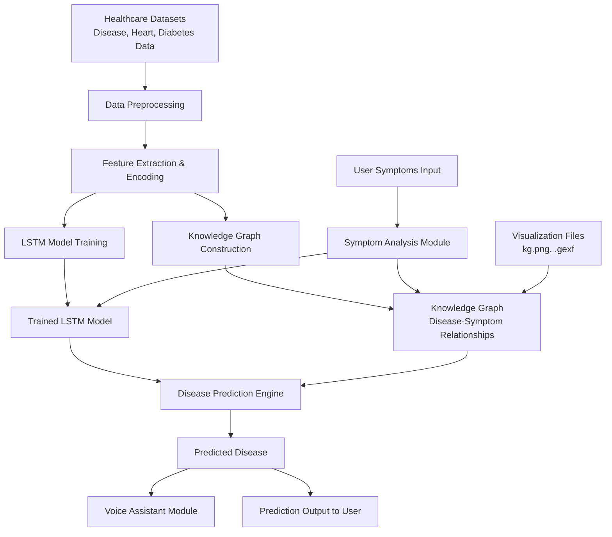

# Disease Prediction using Knowledge Graph and LSTM

## Overview

Disease Prediction using Knowledge Graph and LSTM is an intelligent healthcare system that predicts diseases based on user symptoms by combining deep learning and knowledge graph techniques. The system utilizes Long Short-Term Memory (LSTM) networks for symptom analysis and integrates a knowledge graph to model relationships between diseases and symptoms, thereby improving prediction accuracy and interpretability.

## Features

- Symptom-based disease prediction
- LSTM-based deep learning model for disease classification
- Knowledge Graph integration for enhanced prediction
- Disease-symptom relationship visualization
- Voice-assisted interaction support
- Data preprocessing and feature engineering
- Model training and evaluation pipeline

## Technologies Used

- Python
- TensorFlow / Keras
- LSTM
- Knowledge Graphs
- Pandas
- NumPy
- Scikit-learn
- NetworkX
- Jupyter Notebook

## Project Structure

```text
Disease-Prediction-using-Knowledge-Graph-and-LSTM/
│
├── .gitignore
├── 1.py
├── 2.py
├── DiseaseAndSymptoms.csv
├── Preprocessing.ipynb
├── Preprocessing copy.ipynb
├── Robot-Bot 3D.json
├── bot.jpg
├── diabetes_data.csv
├── heart_data.csv
├── heart_diabetes_knowledge_graph.gexf
├── kg.png
├── knowledge_graph.csv
├── models.py
├── symptom_analysis.py
├── train.py
├── voice.py
└── README.md
```

## Dataset

The project uses multiple healthcare datasets:

- **DiseaseAndSymptoms.csv** - Contains disease and symptom associations.
- **heart_data.csv** - Dataset for heart disease prediction.
- **diabetes_data.csv** - Dataset for diabetes prediction.

## Workflow

1. Collect and preprocess healthcare datasets.
2. Extract and analyze disease-symptom relationships.
3. Construct a knowledge graph representing medical entities.
4. Train the LSTM model using processed symptom data.
5. Accept user symptoms as input.
6. Predict diseases using both the trained model and the knowledge graph.

## Installation

### Clone the Repository

```bash
git clone https://github.com/your-username/Disease-Prediction-using-Knowledge-Graph-and-LSTM.git
```

### Navigate to the Project Directory

```bash
cd Disease-Prediction-using-Knowledge-Graph-and-LSTM
```

### Install Dependencies

```bash
pip install -r requirements.txt
```

## Running the Project

### Train the Model

```bash
python train.py
```

### Run Symptom Analysis

```bash
python symptom_analysis.py
```

### Run Voice Assistant

```bash
python voice.py
```

## Knowledge Graph

The knowledge graph establishes meaningful relationships between diseases and symptoms, enabling more accurate and explainable disease predictions.

## System Architecture




## Future Enhancements

- Support for additional diseases and medical conditions
- Integration of advanced NLP techniques for symptom extraction
- Deployment as a web application using Flask or Streamlit
- Incorporation of transformer-based architectures for improved performance
- Real-time chatbot integration for healthcare assistance

## Author

**Harminder Kour**  
